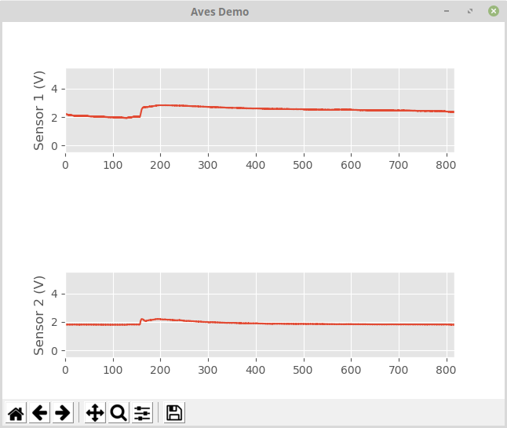

# aves: Acquisition, Visualization and Exploration Software

This python module makes it easy to acquire data from a serial port, visualize it
on real time and record it. It also provides a module for visualizing data previously
acquired with this tool.

## Installation

    pip install aves

Requires Python 3.8+. The real-time plotting GUI needs Tk (already bundled with
the official Python installers on Windows and macOS; on Debian/Ubuntu install
it separately with `sudo apt install python3-tk`). Tk is **not** required for:

- Scripted/headless acquisition (see [Running headless](#running-headless-no-display) below).
- `aves.new_template`/`aves.explorer` as long as `--destdir`/`--filename` are
  always given explicitly (Tk is only used as a fallback to pop up a file/folder
  picker when those flags are omitted).

## Quick start

- We will use an Arduino to send data through the serial port.
- We will use *aves* to acquire, represent and record the data.

1. Prepare the arduino code and the config.yaml file for aves:

       python3 -m aves.new_template --destdir new_project_dir

2. `new_project_dir` will be created, open the `simple_demo.ino` file, compile
   it and upload it to the arduino.

3. Run the demo code, replacing `<port>` with the serial port your arduino is
   connected to (e.g. `COM3` on Windows, `/dev/ttyUSB0` on Linux):

        cd new_project_dir
        python3 -m aves.realtime --port <port> --outfile "test.txt"

    

4. Stop the acquisition (e.g. by closing the program)

5. View the results:

        python3 -m aves.explorer --filename "test.txt"

## Running headless (no display)

If `config.yaml` has no `gui:` section, `aves.realtime` skips the plotting
window entirely and just reads, records and buffers data -- no display or Tk
needed. This is the way to go for unattended/embedded setups (e.g. a
Raspberry Pi with no monitor attached). Everything else (acquisition,
`--outfile`, `--time`, replaying a recorded file as `--port`) works exactly
the same either way.

## Aves configuration

Aves is configured using a `yaml` file with four sections:

- `version`: Just a value, must be 2.
- `input`: Defines the aves input sources.
- `gui`: Controls the real time plotting options. Omit this section entirely
  to run headless (see above).
- `output`: Defines the columns with sensor data that will be saved in a text file.

Besides, there are more tunable parameters. See `python3 -m aves.realtime --help`
for all other command line options, for instance:

- `--no-save` Do not save the captured data to a file
- `--outfile test.txt` Save the capture data to `test.txt`
- `--tmeas 600` Capture data for 600 seconds maximum (default: unlimited)
- `--port COM3` Use the `COM3` serial port
- `--plot_every_n_samples 10` Wait for at least 10 samples to refresh the GUI
- `--plot_win_size 200` Keep up to 200 samples in the plot (use 0 for unlimited)
- `--config another.yaml` Use `another.yaml` as config file.

### The `input` section

Aves uses two sources of information, the *arduino* and the *computer clock*.

For the arduino input, we have multiple parameters:

- `baudrate`: The baudrate specified in the arduino code.
- `timeout`: The seconds the python code will wait for data until it believes the serial connection has been dropped.
- `columns`: Aves must know what is the arduino printing on the serial port. `columns` is a list with as many elements as columns.
    Each element is defined by `name` which gives a name to the column and `conversion_factor` that is used to convert the
    number printed by the arduino to a magnitude meaningful for us. For instance, the conversion_factor is used in the example
    to convert the time printed by the arduino from milliseconds to seconds (0.001), and the sensor reads (in the range 0-1023) to Volts
    (in the range 0-5V): (5V/1023 = 0.004887586). `conversion_factor` is optional and defaults to `1.0` (no conversion) if omitted.
    The columns should be given in the order that they are printed by the arduino.

The computer clock does not have an entry, as it has no options. However, we should remember that besides the columns defined
in the `arduino` section, we also have the `time_computer` column, useful to synchronize our experiment with other information.

### The `gui` section

The `gui` defines the visualization options, including:

- The name of the column used in the `x` axis (`x_column`). It usually is the time given by the Arduino.
- Whether or not the zoom for all the subplots should be shared. It is often convenient to have it shared (`zoom_all_together`).
- The `axes`: The subplots available in the window. Imagine the subplots laid out in a grid. The first subplot (top-left) would be
  in `row: 0`, `col: 0`. The subplot below the first would appear in `row: 1`, `col: 0`, etc. Subplots may span several rows or columns,
  to make them larger, with the `rowspan` and `colspan` options, by default both set to `1`. Each subplot should plot at least one column
  from the input, although more than one column can be plotted. The column names to be plotted for each subplot are given in `columns`.
  Additional plotting options (limits, labels) can be given in `options` (optional, defaults to none).

Besides, there is the name of the window `window_title` and the `refresh_time_ms` that controls how often the GUI is refreshed.

### The `output` section

Controls the columns that will be printed to the text file. Note how we have in the example 
both the computer time and the arduino time printed.

## Known works using aves

- The prototype for fire detection developed at IBEC under the SafeSens project
